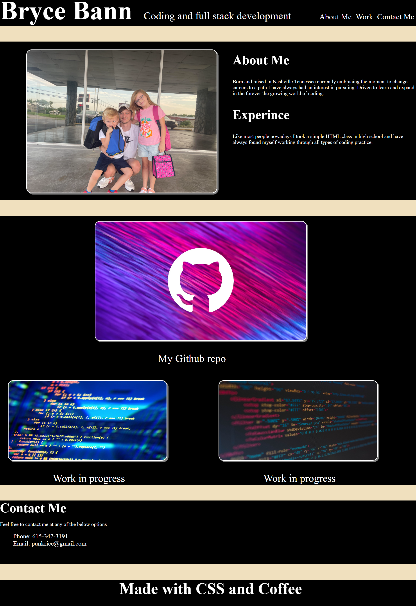

# My portfolio 

## Reason for building

I have built this webpage to help show my where I am currently as i begin coding and as well as my continued growth through the up coming months and years.

 

This is a very simple build with added in quality of life features such as active links to direct to Githib repo and soon many finished and deployed applications and webpages.

 
(<a href="#readme-top">Back to top</a>) (<a herf="https://github.com/BryceBann/My-Portfolio/issues">Report a bug</a>)
 

## Webpage abilities

As stated previously this web page has some quality of life features and more to come.

Some of the Quality of life features include

<ul>
<li>Active link pictures that send you to new tab with my Github Repo</li>
<li>Nav link to guide you wanted section of the page</li>
</ul>
 

Soon to come features

<ul>
<li>Ability to send contact request by phone or email</li>
<li>ACtive implemts of working code set into the webpage working calender, comment section, deployed application bug reporting etc.</li>
<li>More active elements of the wevpage including Slide Show, active appliction in process funtions and more</li>
(<a herf="#readme-top">back to top</a>) (<a herf="https://github.com/BryceBann/My-Portfolio/issues">Report a bug</a>)
 

## Common useage

This webpage will be the center of displaying all my abilities that I could potentily add to new team or future employer.

This page will not shift to far away from hte core reason but do be prepaired for any side projects i find enterianing to be added the webpage

## Road map

The end goal of the this page is to be profesional and on the for front of development and growth.

(<a herf="#readme-top">Back to top</a>) (<a herf="https://github.com/BryceBann/My-Portfolio/issues">Report a bug</a>)